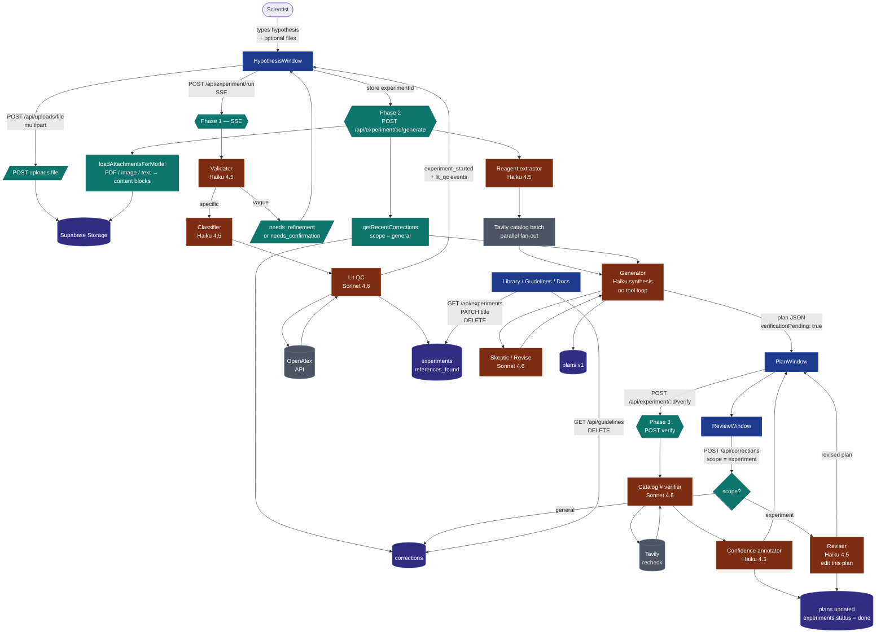

# Aliquot — Architecture

End-to-end flow of a single experiment, from a hypothesis the user types
in the browser to a verified plan persisted in Supabase.

## How to render this diagram

The diagram below is in [Mermaid](https://mermaid.live) syntax:

- **GitHub**: renders inline on this page automatically.
- **Live editor**: copy the block into <https://mermaid.live> for a
  high-res SVG/PNG export — useful for slides + video.
- **CLI / CI**: `npx -y @mermaid-js/mermaid-cli -i docs/architecture.md
  -o docs/architecture.png -b transparent -t dark` to render a PNG.

## Pipeline

## Three-phase split — why

Vercel Hobby caps function execution at 60s. The full 7-stage pipeline
takes 60-90s end-to-end on biology hypotheses, so a single endpoint
would time out mid-generation. Phase 1 + Phase 2 + Phase 3 each finish
inside the cap; the client orchestrates the chain. This also means the
user sees streaming literature results in <5s, then a fully grounded
plan in <40s.

## Stack at a glance

| Layer        | Tech                                                         |
|--------------|--------------------------------------------------------------|
| UI           | Next.js 16 · React 19 · Tailwind 4 · desktop-OS shell        |
| API          | Next.js App Router (Node runtime, Fluid Compute)             |
| Reasoning    | Anthropic Sonnet 4.6 (verifier, lit QC)                      |
| Fast passes  | Anthropic Haiku 4.5 (validator, classifier, generator, confidence, reviser) |
| Search       | Tavily (vendor catalogs) · OpenAlex (literature)             |
| Storage      | Supabase Postgres + Storage + pgvector (corrections embeddings) |
| Hosting      | Vercel                                                       |

## Feedback model

Every correction the user submits in Scientist Review carries a
`scope`:

- `scope = 'experiment'` — applied immediately to *this* plan via the
  reviser. Stored as audit trail. **Never** injected into future
  plans in the domain.
- `scope = 'general'` — added to the domain's guideline pool. Future
  generator runs in the same domain pull recent guidelines as
  few-shot context. Visible + deletable in the Guidelines window.

Two scopes, one storage table, one UI button. The system gets smarter
without conflating one-off edits with durable knowledge.
